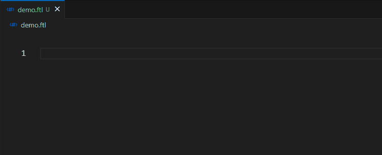

# Auto Close FTL Tag

A fork of [Auto Close Tag](https://github.com/formulahendry/vscode-auto-close-tag) with the support of `FreeMarker` tags in `ftl` file.

- `<#attempt>`
- `<#autoesc>`
- `<#compress>`
- `<#escape>`
- `<#function>`
- `<#if>`
- `<#list>`
- `<#items>`
- `<#macro>`
- `<#noautoesc>`
- `<#noparse>`
- `<#outputformat>`
- `<#switch>`

